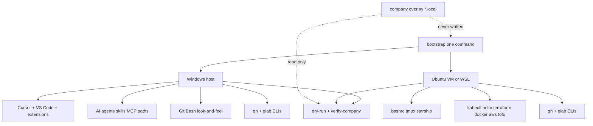

# One-click full stack (Windows IDE + Ubuntu tools)

One command on each OS. **Windows** gets IDE + AI agents + git hosts + look-and-feel. **Ubuntu / WSL** gets matching shell + full CLI toolchain. Company overlay is never overwritten — only verified.

This laptop is the source of truth for personal look-and-feel (harvested into `config/`).



## Locked decisions

- **This laptop is source of truth** for personal look-and-feel (already harvested into `config/`).
- **IDE mostly on Windows** — Cursor / VS Code / AI agents install and config only on Windows (and Windows+WSL bridge per [`cursor-system-setup.md`](../cursor-system-setup.md)). Ubuntu does **not** install Cursor.
- **Full stack** — one click installs personal core + toolchain + Windows IDEs/AI agents + GitHub/GitLab CLI helpers. Interactive auth (`gh auth login` / `glab auth login`) stays manual; tokens never committed.
- **Company settings untouched** — proxy, CA, Nokia git hosts, passwords, kubeconfigs live in `*.local` / machine paths; install never writes them; `dry-run.sh` / `verify-company.sh` only report OK / MISSING / DRIFT.

## Run

```bash
git clone https://github.com/naren4b/dotfiles.git ~/dotfiles
cd ~/dotfiles && ./dry-run.sh
# Windows (admin/winget as needed):
powershell -ExecutionPolicy Bypass -File bootstrap/windows.ps1
# Ubuntu / WSL:
./bootstrap/ubuntu.sh
./company/verify-company.sh
gh auth login    # interactive
glab auth login  # interactive
```

After a look-and-feel tweak on Windows, run `./harvest.sh`, then commit and push so GitHub matches live IDE truth (sanitized).

## What full stack installs

**Windows (`bootstrap/windows.ps1` + Git Bash `install.sh`):**

- Link harvested `config/cursor` + `config/vscode` (settings, keybindings including Ctrl+L)
- Install Cursor + VS Code if missing (`winget`)
- Install extensions from `config/extensions-cursor.txt` and `config/extensions-vscode.txt` (harvested look-and-feel set from this machine, not every random extension)
- Shell/git/tmux/mintty links; create `*.local` from examples only if missing
- Install `gh` and `glab`; print auth steps (no token write)
- Apply WSL bridge alias from `cursor-system-setup.md` when WSL is detected
- Ensure agent skill directories exist (`~/.cursor`, `~/.copilot/skills`) without copying company MCP secrets

**Ubuntu (`bootstrap/ubuntu.sh`):**

- Shell/git/tmux/starship links only (no IDE)
- Tools from `manifest.yaml`: git, curl, vim, kubectl, helm, terraform, opentofu, terragrunt, docker or podman, awscli, starship, fzf, yq, gh, glab
- Same `*.local` create-if-missing rule
- Company verify only

## Repo layout

- Keep: `config/`, `install.sh`, `doctor.sh`, `uninstall.sh`, `lib/dotfiles.sh`
- `dry-run.sh`, `harvest.sh`
- `manifest.yaml` — pinned versions + `windows` / `ubuntu` roles
- `bootstrap/windows.ps1`, `bootstrap/ubuntu.sh`
- `config/extensions-cursor.txt`, `config/extensions-vscode.txt`
- `company/*.example` + `company/verify-company.sh`

## Behavior rules

- Link Cursor/VS Code User files: **Windows only**
- Link bashrc/tmux/git public config: both
- Install full CLI toolchain: **Ubuntu** (Windows gets gh/glab/git + IDE stack)
- Never overwrite existing `~/.bashrc.local`, `~/.gitconfig.local`, company CA/proxy/kubeconfig
- Harvest first on this machine before push so GitHub matches live IDE truth (sanitized)

## Out of scope

- Auto-filling OAuth tokens or copying `mcp.json` with secrets
- Overwriting company proxy/CA/kubeconfig
- Installing Linux-native Cursor on Ubuntu
- Chezmoi / Nix / Ansible

## Verification

- `dry-run.sh` shows live vs repo vs `origin/main` without writing
- Windows: Cursor Ctrl+L form-feed; Night Owl + icons; `gh`/`glab` on PATH; extension IDs from lists installed
- Ubuntu: prompt/aliases match; tool versions match manifest; no Cursor User dir required
- `verify-company.sh` reports Nokia git includeIf / proxy / CA without changing them
- Secret scan clean on committed `config/`
